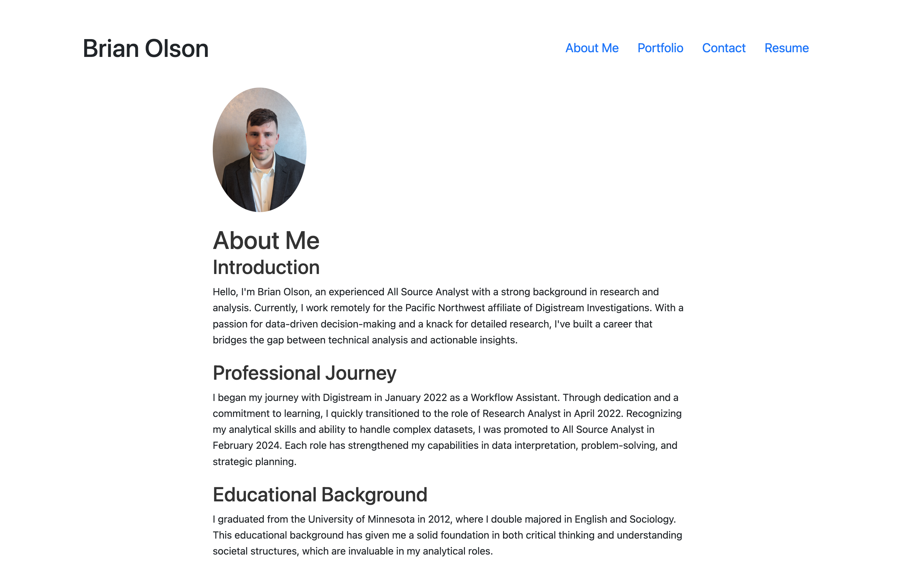

# Brian's React Portfolio

## Description
Welcome to my professional portfolio built with React. This portfolio showcases my projects and skills, providing insights into my development experience and capabilities. The application is designed to be responsive and accessible, ensuring a smooth user experience across all devices.

## Table of Contents
- [Installation](#installation)
- [Usage](#usage)
- [License](#License)
- [Contact](#contact)

## Installation
To set up this portfolio locally, please clone this repository, install necessary dependencies, and start the development server. 

## Usage
After starting the development server, open your web browser and visit http://localhost:3000 to view the portfolio. The navigation bar allows access to various sections of the portfolio, including:

Home: A brief introduction and welcome message.
About Me: Information about my professional background and skills.
Portfolio: A showcase of my projects, each with descriptions, technologies used, and links to live sites and source code.
Contact: A form to contact me directly through the website.

## License 
This project is licensed under the MIT License.

## Contact 
GitHub Profile: [bwolson31](https://github.com/bwolson31)

For additional questions, contact me via email: bwolson31@gmail.com

